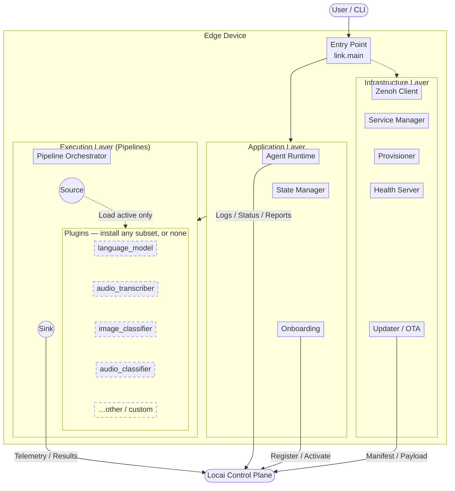

# Locai Link

**Self-hosted edge AI runtime for on-prem and private cloud deployments**

[](https://github.com/locai-co-uk/locai-link/actions/workflows/ci.yml) [](LICENSE.md)

Locai Link is the distributed edge runtime for the [Locai platform](https://locai.co.uk). It is a lightweight agent that turns any device, from a Raspberry Pi to an industrial GPU cluster, into a managed node in your AI fleet. Link handles secure connectivity, model deployment and local inference orchestration on your own hardware, with no cloud dependency. It runs LLMs, speech-to-text, image classification and audio classification on one runtime, air-gapped or connected.

Full documentation is at [docs.locai.co.uk](https://docs.locai.co.uk).

## Quick start

The fastest way to get Link running is to download a pre-built binary from the [Releases page](https://github.com/locai-co-uk/locai-link/releases/latest). No Python, git, or compilers required on the device. The macOS bundle is signed + notarised so it runs without Gatekeeper warnings.

**macOS (Apple Silicon):**

```
curl -L https://github.com/locai-co-uk/locai-link/releases/latest/download/locai-link-macos-arm64-$TAG.tar.gz | tar -xz
./locai-link/locai-link run --device-name "my-edge-device-01" --email "you@example.com" --registration-key "YOUR_REG_KEY"
```

**Linux (x86_64):**

```
curl -L https://github.com/locai-co-uk/locai-link/releases/latest/download/locai-link-linux-x86_64-$TAG.tar.gz | tar -xz
./locai-link/locai-link run --device-name "my-edge-device-01" --email "you@example.com" --registration-key "YOUR_REG_KEY"
```

**Windows (PowerShell):**

```
Invoke-WebRequest https://github.com/locai-co-uk/locai-link/releases/latest/download/locai-link-windows-x86_64-$TAG.zip -OutFile locai-link.zip
Expand-Archive locai-link.zip
.\locai-link\locai-link.exe run --device-name "my-edge-device-01" --email "you@example.com" --registration-key "YOUR_REG_KEY"
```

Replace `$TAG` with the version you want (e.g. `v1.0.12`); the URLs on the Releases page list the exact filenames. Each release also publishes a `.sha256` sidecar so you can verify the download (`sha256sum -c locai-link-…sha256`).

If your Locai account was created via Google sign-in (no password set), the CLI automatically falls back to the OAuth 2.0 device authorization flow — it prints a short code and a URL, and you approve the device in your browser on any other device. See [Onboarding flow](#onboarding-flow) for the full picture.

## How Locai Link compares

**Ollama** is a single-machine local LLM runner. Locai Link runs LLMs locally too (via llama.cpp), but adds fleet management: register hundreds of devices to one control plane, deploy models remotely, and run speech-to-text, image classification and audio classification alongside language models in composable pipelines. We published a [CUDA benchmark comparing Link and Ollama on Gemma](https://locai.co.uk/model-benchmarks/locai-link-vs-ollama) if you want raw numbers.

**Microsoft Foundry Local** requires NVIDIA-certified OEM hardware and manages devices through Azure Arc, a US-controlled control plane. Locai Link runs on hardware you already own, loads any GGUF, ONNX or TFLite model, and the control plane ([Locai Control](https://locai.co.uk)) can be deployed on UK sovereign infrastructure.

If you need AI inference inside a regulated or air-gapped environment where public cloud AI is not an option, that is the use case Link was built for.

## Build from source

The pre-built binaries above are the recommended path for most users. Build from source instead when you want to: track the latest `main`, modify plugins, contribute back, or run on a platform/architecture the Releases page doesn't ship for.

One-line installer that clones the repo, sets up Python via `uv`, and runs the agent in a single command:

**Linux / macOS:**

```
curl -sSL https://raw.githubusercontent.com/locai-co-uk/locai-link/main/install.sh | bash -s -- \
  --device-name "my-edge-device-01" --email "you@example.com" --registration-key "YOUR_REG_KEY"
```

**Windows (PowerShell):**

```
& ([scriptblock]::Create((irm https://raw.githubusercontent.com/locai-co-uk/locai-link/main/install.ps1))) `
  -DeviceName "my-edge-device-01" -Email "you@example.com" -RegistrationKey "YOUR_REG_KEY"
```

**Windows (CMD):**

```
curl -LsSf --ssl-no-revoke https://raw.githubusercontent.com/locai-co-uk/locai-link/main/install.cmd -o install.cmd && install.cmd --device-name "my-edge-device-01" --email "you@example.com" --registration-key "YOUR_REG_KEY"
```

> `--ssl-no-revoke` is needed because Windows curl uses Schannel, which fails the connection with `CRYPT_E_NO_REVOCATION_CHECK (0x80092012)` when it can't reach the certificate's revocation endpoint — common on corporate networks and strict firewalls. The flag skips the revocation lookup only; server certificate validation is unaffected.

The installer prompts interactively for anything you omit, including your platform password.

### Plugin build prerequisites (source builds only)

Source builds compile native plugin binaries from upstream on first use (notably `audio_transcriber`, which builds `whisper-server` from whisper.cpp — upstream does not publish prebuilts for Linux/macOS). The pre-built bundles ship these binaries pre-compiled, so this section only applies to the source-install path above.

Install `git` and `cmake` on the device before deploying a model that uses these plugins:

| Platform      | Command                                         |
| ------------- | ----------------------------------------------- |
| macOS         | `brew install cmake` (git ships with Xcode CLT) |
| Debian/Ubuntu | `sudo apt install cmake git build-essential`    |
| Fedora/RHEL   | `sudo dnf install cmake git gcc-c++`            |
| Arch          | `sudo pacman -S cmake git base-devel`           |
| Windows       | No action — prebuilt binaries are downloaded.   |

## Hacking on the codebase

This guide covers setting up a device to run the Locai agent from source (i.e. this repository).

### Installation

Clone the repository and install dependencies. `main.py setup` will install `uv` itself if needed.

```
git clone https://github.com/locai-co-uk/locai-link.git
cd locai-link
uv run main.py setup          # add --dev for testing/docs tools
```

### Running the agent

Register a new device with a Registration Key from the Locai dashboard:

```
uv run main.py run \
  --device-name "my-edge-device-01" --email "you@example.com" --registration-key "YOUR_REG_KEY"
```

You'll be prompted for your password (or pass `--token <JWT>` to skip). Add `--api-url "<url>"` when pointing at a non-production control plane.

If your account has no password (e.g. Google sign-up), the CLI seamlessly switches to OAuth 2.0 Device Authorization (RFC 8628): you'll see a `XXXX-XXXX` code and a verification URL — open it in any browser, approve the device, and the CLI continues automatically.

On subsequent runs, resume the saved session:

```
uv run main.py run            # or --prod to install as a systemd/launchd/Windows service
```

### CLI reference

| Command                 | Purpose                                                             |
| ----------------------- | ------------------------------------------------------------------- |
| `setup [--dev]`         | Install Python dependencies.                                        |
| `run [options]`         | Resume an existing session, onboard a new device, or load a config. |
| `install [options]`     | Full one-liner flow: clone repo → setup → register → run.           |
| `stop`                  | Stop all running services (`locai-link`, `zenohd`).                 |
| `reset [--hard]`        | Clean up venv, caches, and (with `--hard`) session files.           |
| `install-plugin <name>` | Install a plugin by name.                                           |

### API reference

API docs are generated from source docstrings via `mkdocs` + `mkdocstrings` (part of the `--dev` extras):

```
uv run mkdocs serve           # live-reload server at http://127.0.0.1:8000
uv run mkdocs build           # static site in ./site/
```

Narrative pages live under `docs/`; `docs/reference/` auto-populates from `src/link/` docstrings. The published documentation is at [docs.locai.co.uk](https://docs.locai.co.uk).

### Directory structure

```
src/link/     Application core — app/, components/, infra/, adapters/, config/, utils/
plugins/     Extensions (language_model, audio_transcriber, image_classifier, audio_classifier)
configs/     Runtime config and session state
tests/       Unit tests (mocked, fast)
docs/        mkdocs source (see API reference above)
```

See the API reference for per-module docs.

## Architecture

A modular, pipeline-based runtime. The **control plane** (lifecycle, configuration) is separated from the **data plane** (inference, telemetry) for performance and resilience.



> **Plugins are optional.** Each plugin under `plugins/` is a standalone installable package registering pipeline components via the `locai.plugins` entry point. The runtime only loads plugins referenced by the active config. A device deployment can run with zero plugins (telemetry-only), one (e.g. `language_model`), or any combination.

### Over-the-air updates

When the control plane sends an `UPDATE_AGENT` command, the agent:

1. Reports the command as completed and shuts down all pipelines cleanly
2. Runs `git pull` on the current branch (stashing local changes if needed)
3. Re-runs `uv pip install -e .` to pick up dependency changes
4. Refreshes pinned binaries for plugins referenced by the active config — each `plugins/*/install.py` is tag-cached, so this is cheap when versions haven't changed, and plugins the config doesn't use are skipped entirely
5. Re-execs itself via `os.execv()` — the process image is replaced but the **PID is preserved**, so systemd/launchd/Windows Service see a continuously-running process with no downtime gap

No separate supervisor is needed. The same `main.py run` command works for both development and headless service deployment.

### Onboarding flow

On startup without a session, the agent resolves identity in this order:

1. **`--config <path>`** — load a specific session or raw config file.
2. **Auto-resume** — load the most recent `configs/session_*.json`.
3. **JIT onboarding** — with `--registration-key`, either register (`--device-name` + `--email`/`--token`) or re-activate (`--device-id`).
4. **Factory defaults** — fall back to `configs/default_config.json`.

Registration resolves an auth token via one of three paths:

1. **`--token <JWT>`** — pre-obtained access token. No prompts. Use this for CI / unattended deployments.
2. **`--email` + password** — the CLI prompts for the password via `getpass`, then calls `/auth/login`. Returns a JWT on success.
3. **`--email` + device authorization** — fallback when the account has no password (e.g. Google SSO sign-up). The CLI prints a `XXXX-XXXX` code and a `/link` URL; the user approves on any device with a browser, and the CLI polls until the request is approved (or denied / expired). Implements OAuth 2.0 RFC 8628.

The CLI tries path 2 first when `--email` is provided. If the backend signals `use_device_flow` (HTTP 409), it falls through to path 3 automatically — users with a password keep the snappy one-prompt experience; SSO-only users get the device flow without re-running the command.

Once authenticated, the registration key is exchanged for a device ID and API key.

## Plugins

Plugins are standalone installable packages that register into the runtime via the `locai.plugins` entry point, each providing pipeline components (sources, sinks, or transformers).

| Plugin              | Role                | Binary           | Pinned               |
| ------------------- | ------------------- | ---------------- | -------------------- |
| `language_model`    | Local LLM inference | `llama-server`   | llama.cpp `b8808`    |
| `audio_transcriber` | Speech-to-text      | `whisper-server` | whisper.cpp `v1.8.4` |
| `image_classifier`  | Vision models       | TFLite runtime   | —                    |
| `audio_classifier`  | Audio tagging       | TFLite runtime   | —                    |

Each plugin has its own `install.py` that fetches prebuilt binaries or builds from source (with CUDA toolkit detection on Linux).

```
uv run main.py install-plugin language_model        # install a plugin by name

# Or manually:
uv pip install -e "plugins/language_model[dev]"
uv run python plugins/language_model/install.py
```

## Development

```
uv run pytest                               # unit tests — mocked, fast
uv run pytest plugins/<name>/ -m ""         # plugin integration tests (real binaries + model downloads)

uv run ruff format .                        # format
uv run ruff check .                         # lint

uv run main.py reset                        # clean venv, caches, build artifacts
uv run main.py reset --hard                 # also remove session files in configs/
```

The `ci` pytest marker gates tests needing external binaries or network — skipped locally, enabled in CI.

## Data privacy and telemetry

Locai Link is designed on a "zero data egress" principle.

- **User content:** No inference data, images, video feeds, or model inputs/outputs are ever transmitted to Locai servers without your explicit configuration. Your data stays on your device.
- **Operational metadata:** To function, this software transmits minimal heartbeat data to the Locai Control plane. This includes:
  * Device ID & IP address (for connectivity)
  * Locai Link version
  * System health status (CPU/RAM usage, uptime)

By installing and using this software, you agree to the transmission of this operational metadata for the purpose of device health monitoring and fleet management.

## Licensing

Locai Link is licensed under the Business Source License 1.1 (BUSL). See [LICENSE.md](LICENSE.md) for details.

What this means for you:

- Free to use: you can download, modify, and run this on as many devices as you like.
- Free to distribute: you can include it in hardware products you ship to customers.
- Source available: the code is open for inspection and contribution.
- No managed services: you cannot take this code and sell a hosted Locai service that competes with us.

On January 17, 2030, this restriction lifts and the code automatically becomes Apache 2.0.

## Contributing

We welcome community contributions, whether it's a bug fix, a new feature, or a documentation improvement. Please read [CONTRIBUTING.md](CONTRIBUTING.md) for details on our code of conduct and the Contributor License Agreement (CLA) process.

## About Locai

[Locai](https://locai.co.uk) builds sovereign AI infrastructure for organisations that can't use public cloud AI: financial services, healthcare, defence, national infrastructure and legal. Locai Link is the edge runtime; Locai Control is the management plane. Contact us at hello@locai.co.uk.
