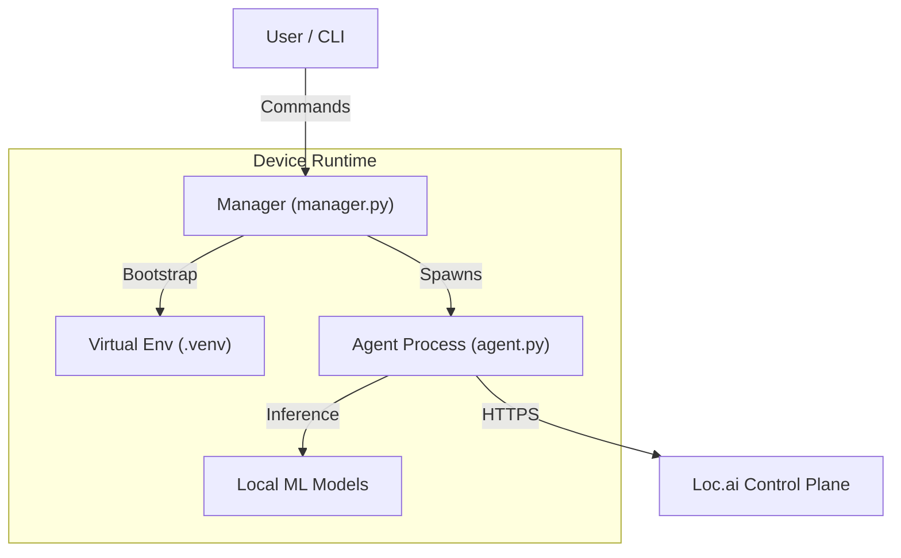

# Loc.ai:Link
**The distributed edge runtime for the Loc.ai platform** <br>
Loc.ai:Link is a lightweight, secure agent that turns any edge device—from a Raspberry Pi to an industrial GPU cluster—into a managed node within your Loc.ai fleet. It handles secure connectivity, model deployment, and local inference orchestration without relying on cloud dependency.

## 🚀 Quick Start

For production deployment on edge devices, use our one-line installer to setup, register and activate the agent.

### Linux / macOS

```bash
curl -sSL https://raw.githubusercontent.com/locai-co-uk/locai-link/main/install.sh | bash -s -- --device-name "cam-01" --username "admin" --registration-key "YOUR_KEY"
```

### Windows

```powershell
# 1. Download and run the installer
powershell -ExecutionPolicy ByPass -c "irm https://raw.githubusercontent.com/locai-co-uk/locai-link/main/install.ps1 | iex"

# 2. Register the device (if not done interactively)
uv run manager.py register --device-name "cam-01" --username "admin" --registration-key "YOUR_KEY"
```

## Architecture Information
Loc.ai:Link operates as a managed process on the edge device. The `manager.py` acts as the lifecycle orchestrator, handling environment setup, updates, and the execution of the main `agent.py`.



## 📖 User Guide (Manual / Source)
This guide covers setting up a device to run the Loc.ai agent from source (this repository).

### Installation

Linux / macOS:

```bash
# Make the script executable
chmod +x run_agent.sh

# Initialise the environment (installs python, dependencies, etc.)
./run_agent.sh setup
```

Windows (PowerShell):

```powershell
# Initialise the environment
.\run_agent.ps1 setup
```

Running the agent without setup will automatically setup prior.

### Device Registration
Before running the agent, you must identify the device to the Loc.ai platform.

Option A: New Device Registration Use this if you have a Registration Key generated from the Loc.ai dashboard.

```bash
./run_agent.sh register \
  --device-name "my-edge-device-01" \
  --username "my-username" \
  --registration-key "YOUR_REG_KEY"
```

Option B: Activate Pre-existing Device Use this if you created the device in the UI and have its Device ID and API Key.

```bash
./run_agent.sh activate \
  --device-id "dev_12345678" \
  --api-key "sk_live_..."
```

### Running the Agent
Once set up and registered, start the runtime. The agent will automatically connect to the control plane and await instructions (model deployments, etc.).

```bash
./run_agent.sh run
```

## 🛠️ Developer Guide
This section is for contributors or users extending the agent's functionality.

### Development Environment Setup
To develop locally, you need to install the dev dependencies (testing tools, linters, etc.).

```bash
# Install with 'dev' extras
./run_agent.sh setup --extras dev
```

### Directory Structure
manager.py: The entry point. Handles setup, venv management, and launching the agent.

src/link/: Source code for the agent logic.

tests/: Unit and integration tests.

models/: Local storage for downloaded ML models.

### Running Tests
We use pytest for testing. Since the environment is managed by uv, run tests via the wrapper:

```bash
# Run all tests
uv run pytest

# Run specific test file
uv run pytest tests/test_agent.py
```

### Code Quality
Ensure your code meets the project standards before submitting a PR.

```bash
# Format code
uv run ruff format .

# Lint code
uv run ruff check .
```

### Resetting the Environment
If your environment gets corrupted or you want a fresh start:

```bash
# Cleans up venv and cache
./run_agent.sh reset

# HARD reset (removes configuration and secrets too)
./run_agent.sh reset --hard
```

## ⚠️ Data Privacy & Telemetry Notice
Loc.ai:Link is designed on a "Zero Data Egress" principle.
- **User Content:** No inference data, images, video feeds, or model inputs/outputs are ever transmitted to Loc.ai servers without your explicit configuration. Your data stays on your device.
- **Operational Metadata:** To function, this software transmits minimal heartbeat data to the Loc.ai:Control plane. This includes:
    - Device ID & IP Address (for connectivity)
    - Loc.ai:Link Version
    - System Health Status (CPU/RAM usage, Uptime)

By installing and using this software, you agree to the transmission of this Operational Metadata for the purpose of device health monitoring and fleet management.

# HARD reset (removes configuration and secrets too)
./run_agent.sh reset --hard

## ⚠️ Data Privacy & Telemetry Notice
Loc.ai:Link is designed on a "Zero Data Egress" principle.
- **User Content:** No inference data, images, video feeds, or model inputs/outputs are ever transmitted to Loc.ai servers without your explicit configuration. Your data stays on your device.
- **Operational Metadata:** To function, this software transmits minimal heartbeat data to the Loc.ai:Control plane. This includes:
    - Device ID & IP Address (for connectivity)
    - Loc.ai:Link Version
    - System Health Status (CPU/RAM usage, Uptime)

By installing and using this software, you agree to the transmission of this Operational Metadata for the purpose of device health monitoring and fleet management.
## 📄 Licensing
Loc.ai:Link is licensed under the Business Source License 1.1 (BSL) see **licence.md** for details.<br>
What this means for you:
- ✅ Free to use: You can download, modify, and run this on as many devices as you like.
- ✅ Free to distribute: You can include it in hardware products you ship to customers.
- ✅ Source Available: The code is open for inspection and contribution.
- 🚫 No Managed Services: You cannot take this code and sell a "Hosted Loc.ai Service" that competes with us.

On January 17, 2030, this restriction lifts, and the code automatically becomes Apache 2.0.
For full legal details, see LICENSE.md.
## 🤝 Contributing
We welcome community contributions! Whether it's a bug fix, a new feature, or a documentation improvement.<br>
Please read **CONTRIBUTING.md** for details on our code of conduct and the Contributor License Agreement (CLA) process.
