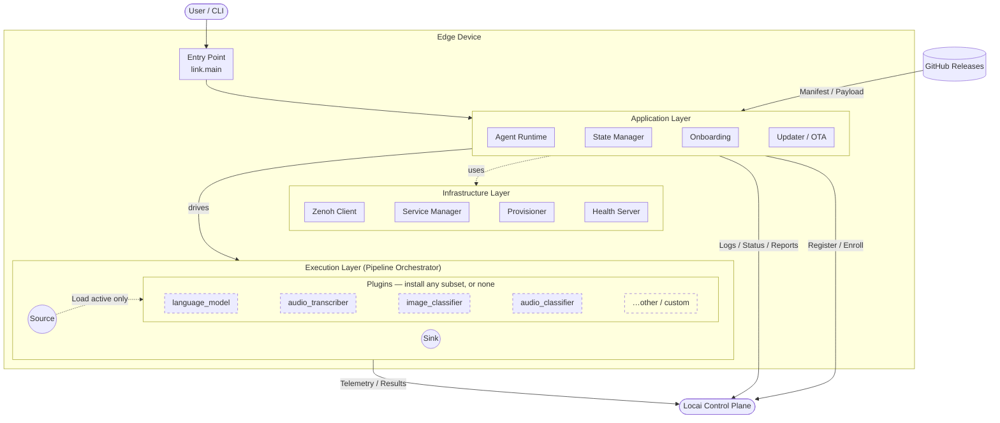

# Locai Link

**Self-hosted edge AI runtime for on-prem and private cloud deployments**

[](https://github.com/locai-co-uk/locai-link/actions/workflows/ci.yml) [](LICENSE.md)

Locai Link is the distributed edge runtime for the [Locai platform](https://locai.co.uk). It is a lightweight agent that turns any device, from a Raspberry Pi to an industrial GPU cluster, into a managed node in your AI fleet. Link handles secure connectivity, model deployment and local inference orchestration on your own hardware, with no cloud dependency. It runs LLMs, speech-to-text, image classification and audio classification on one runtime, air-gapped or connected.

Full documentation is at [docs.locai.co.uk](https://docs.locai.co.uk).

## Quick start

Two ways to run Link. **Headless** is a one-line install for servers and edge devices (no Python, git, or compilers). **Desktop** is the packaged app with a setup UI. Either way, get a registration key from [Control](https://locai.co.uk) and register the device.

### Headless (servers, edge devices)

The installer sets up the background service; you register out-of-band with the key.

**Linux / macOS:**

```sh
curl -fsSL https://get.locai.co.uk/install.sh | sh
```

**Windows (PowerShell):**

```powershell
irm https://get.locai.co.uk/install.ps1 | iex
```

You will now have the `locai` service installed on your machine. To register, run `locai register --registration-key "YOUR_REG_KEY"`. For a fleet, register with `--fleet-key` instead. To register unattended in one step, set `LOCAI_REGISTRATION_KEY` (or `LOCAI_FLEET_KEY`) before running the install command. Check status any time with `locai status`; update with `locai update`.

### Desktop (macOS)

Download the signed + notarised app from the [Releases page](https://github.com/locai-co-uk/locai-link/releases/latest) and follow the setup assistant. (Windows and Linux desktop builds follow later.)

Onboarding is key-only and machine-bound: the registration key from Control is the credential, and Control binds the device to this machine and assigns its id and name. See [Onboarding flow](#onboarding-flow) for the full picture. To run from a git checkout instead, see [Build from source](#build-from-source).

## How Locai Link compares

**Ollama** is a single-machine local LLM runner. Locai Link runs LLMs locally too (via llama.cpp), but adds fleet management: register hundreds of devices to one control plane, deploy models remotely, and run speech-to-text, image classification and audio classification alongside language models in composable pipelines. We published a [CUDA benchmark comparing Link and Ollama on Gemma](https://locai.co.uk/model-benchmarks/locai-link-vs-ollama) if you want raw numbers.

**Microsoft Foundry Local** requires NVIDIA-certified OEM hardware and manages devices through Azure Arc, a US-controlled control plane. Locai Link runs on hardware you already own, loads any GGUF, ONNX or TFLite model, and the control plane ([Locai Control](https://locai.co.uk)) can be deployed on UK sovereign infrastructure.

If you need AI inference inside a regulated or air-gapped environment where public cloud AI is not an option, that is the use case Link was built for.

## Build from source

The Quick start installers above are the recommended path for most users. Build from source instead when you want to: track the latest `main`, modify plugins, contribute back, or run on a platform/architecture the Releases page doesn't ship for.

Clone the repo and onboard the device with a single `run`. `uv` provisions the Python environment on first invocation, so no separate install step is needed:

```sh
git clone https://github.com/locai-co-uk/locai-link.git
cd locai-link
uv run main.py run --registration-key "YOUR_REG_KEY"
```

The registration key is the only credential; Control assigns the device id and name from the machine.

Enrolling with an org-scoped fleet key instead? Use `--fleet-key "YOUR_FLEET_KEY"` (accepts the key itself or `file:<path>`).

### Plugin build prerequisites (source builds only)

Source builds compile native plugin binaries from upstream on first use (notably `audio_transcriber`, which builds `whisper-server` from whisper.cpp — upstream does not publish prebuilts for Linux/macOS). The pre-built bundles ship these binaries pre-compiled, so this section only applies to the source-install path above.

Install `git` and `cmake` on the device before deploying a model that uses these plugins:

| Platform      | Command                                         |
| ------------- | ----------------------------------------------- |
| macOS         | `brew install cmake` (git ships with Xcode CLT) |
| Debian/Ubuntu | `sudo apt install cmake git build-essential`    |
| Fedora/RHEL   | `sudo dnf install cmake git gcc-c++`            |
| Arch          | `sudo pacman -S cmake git base-devel`           |
| Windows       | No action — prebuilt binaries are downloaded.   |

## Hacking on the codebase

This guide covers setting up a device to run the Locai agent from source (i.e. this repository).

### Installation

Clone the repository and install dependencies with `uv`:

```
git clone https://github.com/locai-co-uk/locai-link.git
cd locai-link
uv pip install -e ".[dev]"    # dev extras: testing + docs tools
```

### Running the agent

Register a new device with a Registration Key from the Locai dashboard:

```
uv run main.py run --registration-key "YOUR_REG_KEY"
```

The key is the credential; Control binds the device to this machine and assigns its id and name. Add `--api-url "<url>"` when pointing at a non-production control plane.

On subsequent runs, resume the saved session:

```sh
uv run main.py run
```

Deploy as a background service (systemd/launchd/Windows) with the release installers under `scripts/`; register out-of-band with `locai register --registration-key <KEY>`.

### CLI reference

| Command                 | Purpose                                                             |
| ----------------------- | ------------------------------------------------------------------- |
| `run [options]`         | Resume an existing session, onboard with a key, or load a config.   |
| `register [options]`    | Register this device with a key, write the session, and exit.       |
| `status`                | Show registration, service, and update status.                      |
| `update [--force]`      | Update the running service to the latest version.                   |
| `reset [--hard]`        | Clean up venv, caches, and (with `--hard`) session files. Source builds only. |
| `install-plugin <name>` | Install a plugin by name. Source builds only.                       |

Installed devices (the release builds) additionally get the native lifecycle
commands `locai start|stop|restart|uninstall`; those are not available from a
source checkout, which runs in the foreground under `uv run main.py run`.

### API reference

API docs are generated from source docstrings via `mkdocs` + `mkdocstrings` (part of the `--dev` extras):

```
uv run mkdocs serve           # live-reload server at http://127.0.0.1:8000
uv run mkdocs build           # static site in ./site/
```

Narrative pages live under `docs/`; `docs/reference/` auto-populates from `src/link/` docstrings. The published documentation is at [docs.locai.co.uk](https://docs.locai.co.uk).

### Directory structure

```
src/link/     Application core — app/, components/, infra/, adapters/, config/, utils/
plugins/     Extensions (language_model, audio_transcriber, image_classifier, audio_classifier)
configs/     Runtime config and session state
tests/       Unit tests (mocked, fast)
docs/        mkdocs source (see API reference above)
```

See the API reference for per-module docs.

## Architecture

A modular, pipeline-based runtime. The **control plane** (lifecycle, configuration) is separated from the **data plane** (inference, telemetry) for performance and resilience.



> **Plugins are optional.** Each plugin under `plugins/` is a standalone installable package registering pipeline components via the `locai.plugins` entry point. The runtime only loads plugins referenced by the active config. A device deployment can run with zero plugins (telemetry-only), one (e.g. `language_model`), or any combination.

### Over-the-air updates

On an `UPDATE_AGENT` command (from the control plane, or the loopback `/update` endpoint the menu-bar app posts to), the agent reports the command complete, shuts down all pipelines cleanly, then takes one of two paths depending on how it was installed:

**Bundled install** (PyInstaller artifact, the packaged app):

1. Resolves the latest matching release from **GitHub Releases** and downloads the platform bundle
2. Verifies the SHA256, extracts it alongside the running version under `versions/<v>/`
3. Health-checks the new runtime, then **atomically flips the `current` pointer** and garbage-collects old versions
4. Exits with code `42`; the launcher relaunches from the new `current`. A `.update-pending` stamp lets the launcher roll back if the new version fails to boot

**Source install** (cloned repo):

1. Runs `git pull` on the current branch (stashing local changes if needed) and re-runs `uv pip install -e .`
2. Refreshes pinned binaries for plugins referenced by the active config (each `plugins/*/install.py` is tag-cached, so this is cheap when versions haven't changed, and unused plugins are skipped)
3. Re-execs itself via `os.execv()`; the process image is replaced but the **PID is preserved**, so systemd/launchd/Windows Service see a continuously-running process

Either way no separate supervisor is needed, and the same `main.py run` command works for development and headless service deployment.

### Onboarding flow

On startup without a session, the agent resolves identity in this order:

1. **`--config <path>`** — load a specific session or raw config file.
2. **Auto-resume** — load the most recent `configs/session_*.json`.
3. **Key onboarding** — with `--registration-key` (single device) or `--fleet-key` (org-scoped), register/enroll with Control.
4. **Fleet marker** — a previously fleet-enrolled device with no session fails loudly rather than re-bootstrapping as a fresh agent.
5. **Factory defaults** — fall back to `configs/default_config.json`.

Onboarding is key-only and machine-bound. The key is sent as the bearer credential (no user login); the CLI identifies the machine by its id hash and hostname, and Control assigns the device id and name and returns an API key plus the agent config. Re-running from the same machine is an idempotent retry that rotates the API key, so installer re-runs are safe.

## Plugins

Plugins are standalone installable packages that register into the runtime via the `locai.plugins` entry point, each providing pipeline components (sources, sinks, or transformers).

| Plugin              | Role                | Binary           | Pinned               |
| ------------------- | ------------------- | ---------------- | -------------------- |
| `language_model`    | Local LLM inference | `llama-server`   | llama.cpp `b8808`    |
| `audio_transcriber` | Speech-to-text      | `whisper-server` | whisper.cpp `v1.8.4` |
| `image_classifier`  | Vision models       | TFLite runtime   | —                    |
| `audio_classifier`  | Audio tagging       | TFLite runtime   | —                    |

Each plugin has its own `install.py` that fetches prebuilt binaries or builds from source (with CUDA toolkit detection on Linux).

```
uv run main.py install-plugin language_model        # install a plugin by name

# Or manually:
uv pip install -e "plugins/language_model[dev]"
uv run python plugins/language_model/install.py
```

## Development

```
uv run pytest                               # unit tests — mocked, fast
uv run pytest plugins/<name>/ -m ""         # plugin integration tests (real binaries + model downloads)

uv run ruff format .                        # format
uv run ruff check .                         # lint

uv run main.py reset                        # clean venv, caches, build artifacts
uv run main.py reset --hard                 # also remove session files in configs/
```

The `ci` pytest marker gates tests needing external binaries or network — skipped locally, enabled in CI.

## Data privacy and telemetry

Locai Link is designed on a "zero data egress" principle.

- **User content:** No inference data, images, video feeds, or model inputs/outputs are ever transmitted to Locai servers without your explicit configuration. Your data stays on your device.
- **Operational metadata:** To function, this software transmits minimal heartbeat data to the Locai Control plane. This includes:
  * Device ID & IP address (for connectivity)
  * Locai Link version
  * System health status (CPU/RAM usage, uptime)

By installing and using this software, you agree to the transmission of this operational metadata for the purpose of device health monitoring and fleet management.

## Licensing

Locai Link is licensed under the Business Source License 1.1 (BUSL). See [LICENSE.md](LICENSE.md) for details.

What this means for you:

- Free to use: you can download, modify, and run this on as many devices as you like.
- Free to distribute: you can include it in hardware products you ship to customers.
- Source available: the code is open for inspection and contribution.
- No managed services: you cannot take this code and sell a hosted Locai service that competes with us.

On January 17, 2030, this restriction lifts and the code automatically becomes Apache 2.0.

## Contributing

We welcome community contributions, whether it's a bug fix, a new feature, or a documentation improvement. Please read [CONTRIBUTING.md](CONTRIBUTING.md) for details on our code of conduct and the Contributor License Agreement (CLA) process.

## About Locai

[Locai](https://locai.co.uk) builds sovereign AI infrastructure for organisations that can't use public cloud AI: financial services, healthcare, defence, national infrastructure and legal. Locai Link is the edge runtime; Locai Control is the management plane. Contact us at hello@locai.co.uk.
