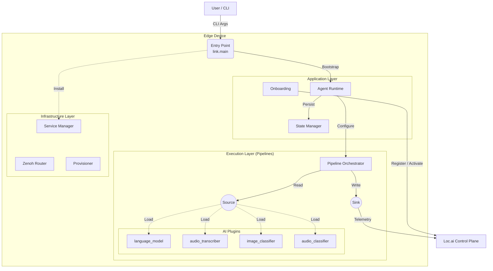

# Loc.ai:Link


**The distributed edge runtime for the Loc.ai platform** <br>
Loc.ai:Link is a lightweight, secure agent that turns any edge device—from a Raspberry Pi to an industrial GPU cluster—into a managed node within your Loc.ai fleet. It handles secure connectivity, model deployment, and local inference orchestration without relying on cloud dependency.

## Quick Start

For production deployment on edge devices, use our one-line installer to setup, register and activate the agent.

**Linux / macOS:**
```bash
curl -sSL https://raw.githubusercontent.com/locai-co-uk/locai-link/main/install.sh | bash -s -- \
  --device-name "my-edge-device-01" \
  --email "you@example.com" \
  --registration-key "YOUR_REG_KEY" \
  --start-running
```

**Windows (PowerShell):**
```powershell
& ([scriptblock]::Create((irm https://raw.githubusercontent.com/locai-co-uk/locai-link/main/install.ps1))) `
  -DeviceName "my-edge-device-01" `
  -Email "you@example.com" `
  -RegistrationKey "YOUR_REG_KEY" `
  -StartRunning
```

**Windows (CMD):**
```cmd
curl -LsSf https://raw.githubusercontent.com/locai-co-uk/locai-link/main/install.cmd -o install.cmd && install.cmd --device-name "my-edge-device-01" --email "you@example.com" --registration-key "YOUR_REG_KEY" --start-running
```

The installer will prompt securely for your platform password. If you omit any required argument, the installer will prompt for it interactively.

## Build from Source
This guide covers setting up a device to run the Loc.ai agent from source (this repository).

### Installation
First clone the repository (or download release):

```bash
git clone https://github.com/locai-co-uk/locai-link.git
cd locai-link
```

You can setup the device with the manager (`main.py`) directly.

```bash
python3 main.py setup

# or with uv if its installed (the manager will install it if not)
uv run main.py setup
```

### Device Registration
Before running the agent, you must identify the device to the Loc.ai platform.

For new devices, use this if you have a Registration Key generated from the Loc.ai dashboard.

```bash
uv run main.py run \
  --device-name "my-edge-device-01" \
  --email "you@example.com" \
  --registration-key "YOUR_REG_KEY"
```

You will be prompted securely for your platform password. Alternatively, pass a pre-obtained JWT via `--token` to skip the login step.

If you already have a session (registered instance), just run:

```bash
uv run main.py run
```

### Running the Agent
Once set up and registered, start the runtime. The agent will automatically connect to the control plane and await instructions (model deployments, etc.).

```bash
uv run main.py run
```

To deploy the agent as a background OS service (systemd on Linux, LaunchAgent on macOS, Windows Service on Windows), pass `--prod`:

```bash
uv run main.py run --prod
```

### CLI Reference

| Command | Purpose |
|---------|---------|
| `setup [--dev] [--tui]` | Install Python dependencies (optionally with dev or TUI extras). |
| `run [options]` | Resume an existing session, onboard a new device, or load a config. |
| `install [options]` | Full one-liner flow: clone repo → setup → register → run. |
| `stop` | Stop all running services (`locai-link`, `zenohd`). |
| `reset [--hard]` | Clean up venv, caches, and (with `--hard`) session files. |
| `install-plugin <name>` | Install a plugin by name. |
| `tui` | Launch the text UI (requires the `tui` extra). |

### Development Environment Setup
To develop locally, you need to install the dev dependencies (testing tools, linters, etc.).

```bash
# Install with 'dev' extras
uv run main.py setup --dev
```

When registering pass `--api-url "<your local url>"` if not using the production API.

### Directory Structure

```
project_root/
├── src/link/                   <-- APPLICATION CORE
│   ├── main.py                 <-- CLI entry point (setup, run, install, reset, ...)
│   ├── app/                    <-- Orchestration Layer
│   │   ├── runtime.py          <-- Main Agent Loop & Lifecycle
│   │   ├── state.py            <-- Persistence & Crash Recovery
│   │   └── onboarding.py       <-- Registration & Activation Logic
│   │
│   ├── components/             <-- Pipeline Building Blocks
│   │   ├── pipeline.py         <-- Threaded Pipeline Executor
│   │   ├── registry.py         <-- Dynamic Component Loader
│   │   ├── basic.py            <-- ClockTick, Console, RandomGenerator
│   │   ├── command.py          <-- Command dispatch sink
│   │   ├── buffers.py          <-- Local buffering (WIP)
│   │   ├── http.py             <-- HTTP Sources/Sinks
│   │   ├── system.py           <-- System Metrics Source
│   │   └── zenoh.py            <-- Zenoh Pub/Sub Components
│   │
│   ├── infra/                  <-- System Infrastructure
│   │   ├── service.py          <-- systemd/launchd/sc Service Manager
│   │   ├── provision.py        <-- Binary Downloader (Zenoh, Plugins)
│   │   ├── zenoh.py            <-- Zenoh Router Process Manager
│   │   └── utils.py            <-- Platform-arch detection
│   │
│   ├── adapters/               <-- Interface Adapters
│   │   ├── http_client.py      <-- Robust HTTP client with typed errors
│   │   ├── zenoh_client.py     <-- Zenoh Python API wrapper
│   │   └── persistence.py      <-- Storage backends
│   │
│   ├── config/                 <-- Data Definition Layer
│   │   ├── loader.py           <-- Config parser & validation
│   │   └── models.py           <-- Pydantic data models
│   │
│   ├── ui/                     <-- Optional textual UI
│   └── utils/                  <-- Shared utilities
│       └── logger.py           <-- Structured logging & reporting
│
├── plugins/                    <-- EXTENSIONS (User Space)
│   ├── language_model/         <-- Local LLM via llama.cpp
│   ├── audio_transcriber/      <-- Speech-to-text via whisper.cpp
│   ├── image_classifier/       <-- Vision inference (TFLite)
│   └── audio_classifier/       <-- Audio classification (TFLite)
│
├── configs/                    <-- Runtime configuration + session state
├── tests/                      <-- Unit tests (mocked, fast)
├── install.sh / .ps1 / .cmd    <-- One-liner bootstrappers
├── main.py                     <-- Thin wrapper around src/link/main.py
└── pyproject.toml              <-- Build & dependency config
```

## Architecture

Loc.ai:Link is designed as a modular, pipeline-based runtime. It separates the **Control Plane** (Lifecycle, Configuration) from the **Data Plane** (Inference, Telemetry) to ensure high performance and resilience.




### Over-The-Air Updates

When the control plane sends an `UPDATE_AGENT` command, the agent:

1. Reports the command as completed and shuts down all pipelines cleanly
2. Runs `git pull` on the current branch (stashing local changes if needed)
3. Re-runs `uv pip install -e .` to pick up dependency changes
4. Re-runs every `plugins/*/install.py` to refresh pinned binaries (cached by tag, so this is cheap when versions haven't changed)
5. Re-execs itself via `os.execv()` — the process image is replaced but the **PID is preserved**, so systemd/launchd/Windows Service see a continuously-running process with no downtime gap

No separate supervisor is needed. The same `main.py run` command works for both development (where you can Ctrl-C) and headless service deployment.

### Onboarding Flow

When the agent starts without an existing session, it resolves identity in this order:

1. **`--config <path>`** — Load a specific session or raw config file.
2. **Auto-resume** — Load the most recent `configs/session_*.json`.
3. **JIT onboarding** — If `--registration-key` is provided:
   - With `--device-name` + (`--email` or `--token`) → register a new device.
   - With `--device-id` → re-activate an existing device.
4. **Factory defaults** — Fall back to `configs/default_config.json`.

Registration authenticates against the Loc.ai control plane using email/password (login returns a JWT) or a pre-obtained `--token`, then exchanges the registration key for a device ID and API key.

## Plugins

Plugins are standalone installable Python packages that register into the runtime via the `locai.plugins` entry point. Each plugin provides one or more pipeline components (sources, sinks, or transformers).

| Plugin | Role | Binary | Pinned |
|--------|------|--------|--------|
| `language_model` | Local LLM inference | `llama-server` | llama.cpp `b8808` |
| `audio_transcriber` | Speech-to-text | `whisper-server` | whisper.cpp `v1.8.4` |
| `image_classifier` | Vision models | TFLite runtime | — |
| `audio_classifier` | Audio tagging | TFLite runtime | — |

Each plugin has its own `install.py` that fetches prebuilt binaries or builds from source (Linux/macOS with CUDA toolkit detection). Install them individually:

```bash
uv pip install -e "plugins/language_model[dev]"
uv run python plugins/language_model/install.py
```

Or install a plugin by name once the agent is running:

```bash
uv run main.py install-plugin language_model
```

### Running Tests
We use pytest for testing. Since the environment is managed by uv, run tests via the wrapper:

```bash
# Run all unit tests (fast, mocked)
uv run pytest

# Run plugin integration tests (requires installed binaries + model downloads)
uv run pytest plugins/language_model/ -m ""
uv run pytest plugins/audio_transcriber/ -m ""
```

Tests are split into two tiers:
- **Unit tests** (`tests/`) — mocked, run on every commit across Linux/macOS/Windows.
- **Integration tests** (`plugins/*/test_*.py`) — download real models and spawn real server binaries. Run in CI's `integration-test` job.

The `ci` pytest marker gates tests that need external binaries or network — skipped locally by default, enabled in CI.

### Code Quality
Ensure your code meets the project standards before submitting a PR.

```bash
# Format code
uv run ruff format .

# Lint code
uv run ruff check .
```

### Resetting the Environment
If your environment gets corrupted or you want a fresh start:

```bash
# Cleans up venv, caches, and build artifacts
uv run main.py reset

# HARD reset (also removes session files in configs/)
uv run main.py reset --hard
```

## ⚠️ Data Privacy & Telemetry Notice
Loc.ai:Link is designed on a "Zero Data Egress" principle.
- **User Content:** No inference data, images, video feeds, or model inputs/outputs are ever transmitted to Loc.ai servers without your explicit configuration. Your data stays on your device.
- **Operational Metadata:** To function, this software transmits minimal heartbeat data to the Loc.ai:Control plane. This includes:
    - Device ID & IP Address (for connectivity)
    - Loc.ai:Link Version
    - System Health Status (CPU/RAM usage, Uptime)

By installing and using this software, you agree to the transmission of this Operational Metadata for the purpose of device health monitoring and fleet management.

## 📄 Licensing
Loc.ai:Link is licensed under the Business Source License 1.1 (BSL) see **licence.md** for details.<br>
What this means for you:
- ✅ Free to use: You can download, modify, and run this on as many devices as you like.
- ✅ Free to distribute: You can include it in hardware products you ship to customers.
- ✅ Source Available: The code is open for inspection and contribution.
- 🚫 No Managed Services: You cannot take this code and sell a "Hosted Loc.ai Service" that competes with us.

On January 17, 2030, this restriction lifts, and the code automatically becomes Apache 2.0.
For full legal details, see LICENSE.md.

## 🤝 Contributing
We welcome community contributions! Whether it's a bug fix, a new feature, or a documentation improvement.<br>
Please read **CONTRIBUTING.md** for details on our code of conduct and the Contributor License Agreement (CLA) process.
