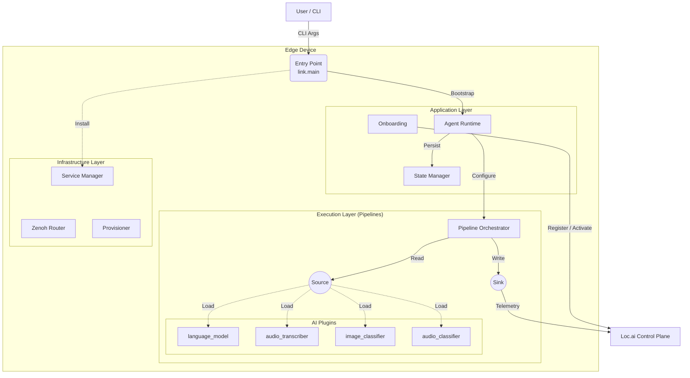

# Loc.ai:Link


**The distributed edge runtime for the Loc.ai platform** <br>
Loc.ai:Link is a lightweight, secure agent that turns any edge device—from a Raspberry Pi to an industrial GPU cluster—into a managed node within your Loc.ai fleet. It handles secure connectivity, model deployment, and local inference orchestration without relying on cloud dependency.

## Quick Start

One-line installer for edge devices — sets up, registers, and activates in a single command.

**Linux / macOS:**
```bash
curl -sSL https://raw.githubusercontent.com/locai-co-uk/locai-link/main/install.sh | bash -s -- \
  --device-name "my-edge-device-01" \
  --email "you@example.com" \
  --registration-key "YOUR_REG_KEY"
```

**Windows (PowerShell):**
```powershell
& ([scriptblock]::Create((irm https://raw.githubusercontent.com/locai-co-uk/locai-link/main/install.ps1))) `
  -DeviceName "my-edge-device-01" `
  -Email "you@example.com" `
  -RegistrationKey "YOUR_REG_KEY"
```

**Windows (CMD):**
```cmd
curl -LsSf https://raw.githubusercontent.com/locai-co-uk/locai-link/main/install.cmd -o install.cmd && install.cmd --device-name "my-edge-device-01" --email "you@example.com" --registration-key "YOUR_REG_KEY"
```

The installer prompts interactively for anything you omit, including your platform password.

## Build from Source
This guide covers setting up a device to run the Loc.ai agent from source (i.e. this repository).

### Installation
Clone the repository and install dependencies. `main.py setup` will install `uv` itself if needed.

```bash
git clone https://github.com/locai-co-uk/locai-link.git
cd locai-link
uv run main.py setup          # add --dev for testing/docs tools, --tui for the text UI
```

### Running the Agent
Register a new device with a Registration Key from the Loc.ai dashboard:

```bash
uv run main.py run \
  --device-name "my-edge-device-01" \
  --email "you@example.com" \
  --registration-key "YOUR_REG_KEY"
```

You'll be prompted for your password (or pass `--token <JWT>` to skip). Add `--api-url "<url>"` when pointing at a non-production control plane.

On subsequent runs, resume the saved session:

```bash
uv run main.py run            # or --prod to install as a systemd/launchd/Windows service
```

### CLI Reference

| Command | Purpose |
|---------|---------|
| `setup [--dev] [--tui]` | Install Python dependencies. |
| `run [options]` | Resume an existing session, onboard a new device, or load a config. |
| `install [options]` | Full one-liner flow: clone repo → setup → register → run. |
| `stop` | Stop all running services (`locai-link`, `zenohd`). |
| `reset [--hard]` | Clean up venv, caches, and (with `--hard`) session files. |
| `install-plugin <name>` | Install a plugin by name. |
| `tui` | Launch the text UI (requires the `tui` extra). |

### API Reference
API docs are generated from source docstrings via `mkdocs` + `mkdocstrings` (part of the `--dev` extras):

```bash
uv run mkdocs serve           # live-reload server at http://127.0.0.1:8000
uv run mkdocs build           # static site in ./site/
```

Narrative pages live under `docs/`; `docs/reference/` auto-populates from `src/link/` docstrings.

### Directory Structure

```
src/link/     Application core — app/, components/, infra/, adapters/, config/, utils/
plugins/     Extensions (language_model, audio_transcriber, image_classifier, audio_classifier)
configs/     Runtime config and session state
tests/       Unit tests (mocked, fast)
docs/        mkdocs source (see API Reference above)
```

See the API Reference for per-module docs.

## Architecture

A modular, pipeline-based runtime. The **control plane** (lifecycle, configuration) is separated from the **data plane** (inference, telemetry) for performance and resilience.



### Over-The-Air Updates

When the control plane sends an `UPDATE_AGENT` command, the agent:

1. Reports the command as completed and shuts down all pipelines cleanly
2. Runs `git pull` on the current branch (stashing local changes if needed)
3. Re-runs `uv pip install -e .` to pick up dependency changes
4. Refreshes pinned binaries for plugins referenced by the active config — each `plugins/*/install.py` is tag-cached, so this is cheap when versions haven't changed, and plugins the config doesn't use are skipped entirely
5. Re-execs itself via `os.execv()` — the process image is replaced but the **PID is preserved**, so systemd/launchd/Windows Service see a continuously-running process with no downtime gap

No separate supervisor is needed. The same `main.py run` command works for both development and headless service deployment.

### Onboarding Flow

On startup without a session, the agent resolves identity in this order:

1. **`--config <path>`** — load a specific session or raw config file.
2. **Auto-resume** — load the most recent `configs/session_*.json`.
3. **JIT onboarding** — with `--registration-key`, either register (`--device-name` + `--email`/`--token`) or re-activate (`--device-id`).
4. **Factory defaults** — fall back to `configs/default_config.json`.

Registration authenticates with email/password (login returns a JWT) or a pre-obtained `--token`, then exchanges the registration key for a device ID and API key.

## Plugins

Plugins are standalone installable packages that register into the runtime via the `locai.plugins` entry point, each providing pipeline components (sources, sinks, or transformers).

| Plugin | Role | Binary | Pinned |
|--------|------|--------|--------|
| `language_model` | Local LLM inference | `llama-server` | llama.cpp `b8808` |
| `audio_transcriber` | Speech-to-text | `whisper-server` | whisper.cpp `v1.8.4` |
| `image_classifier` | Vision models | TFLite runtime | — |
| `audio_classifier` | Audio tagging | TFLite runtime | — |

Each plugin has its own `install.py` that fetches prebuilt binaries or builds from source (with CUDA toolkit detection on Linux).

```bash
uv run main.py install-plugin language_model        # install a plugin by name

# Or manually:
uv pip install -e "plugins/language_model[dev]"
uv run python plugins/language_model/install.py
```

## Development

```bash
uv run pytest                               # unit tests — mocked, fast
uv run pytest plugins/<name>/ -m ""         # plugin integration tests (real binaries + model downloads)

uv run ruff format .                        # format
uv run ruff check .                         # lint

uv run main.py reset                        # clean venv, caches, build artifacts
uv run main.py reset --hard                 # also remove session files in configs/
```

The `ci` pytest marker gates tests needing external binaries or network — skipped locally, enabled in CI.

## ⚠️ Data Privacy & Telemetry Notice
Loc.ai:Link is designed on a "Zero Data Egress" principle.
- **User Content:** No inference data, images, video feeds, or model inputs/outputs are ever transmitted to Loc.ai servers without your explicit configuration. Your data stays on your device.
- **Operational Metadata:** To function, this software transmits minimal heartbeat data to the Loc.ai:Control plane. This includes:
    - Device ID & IP Address (for connectivity)
    - Loc.ai:Link Version
    - System Health Status (CPU/RAM usage, Uptime)

By installing and using this software, you agree to the transmission of this Operational Metadata for the purpose of device health monitoring and fleet management.

## 📄 Licensing
Loc.ai:Link is licensed under the Business Source License 1.1 (BSL) see **licence.md** for details.<br>
What this means for you:
- ✅ Free to use: You can download, modify, and run this on as many devices as you like.
- ✅ Free to distribute: You can include it in hardware products you ship to customers.
- ✅ Source Available: The code is open for inspection and contribution.
- 🚫 No Managed Services: You cannot take this code and sell a "Hosted Loc.ai Service" that competes with us.

On January 17, 2030, this restriction lifts, and the code automatically becomes Apache 2.0.
For full legal details, see LICENSE.md.

## 🤝 Contributing
We welcome community contributions! Whether it's a bug fix, a new feature, or a documentation improvement.<br>
Please read **CONTRIBUTING.md** for details on our code of conduct and the Contributor License Agreement (CLA) process.
