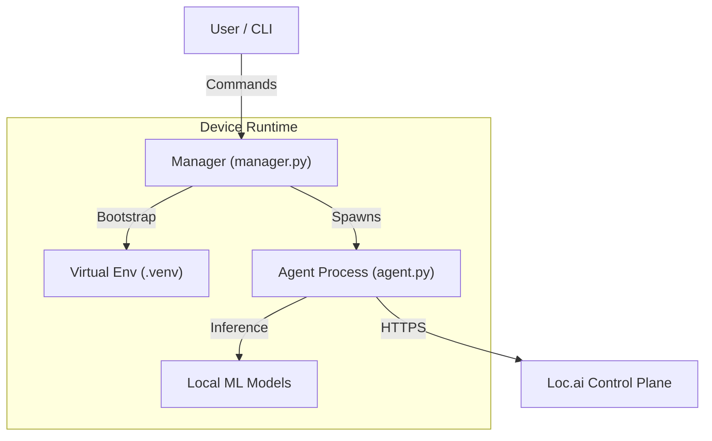

# Loc.ai:Link


**The distributed edge runtime for the Loc.ai platform** <br>
Loc.ai:Link is a lightweight, secure agent that turns any edge device—from a Raspberry Pi to an industrial GPU cluster—into a managed node within your Loc.ai fleet. It handles secure connectivity, model deployment, and local inference orchestration without relying on cloud dependency.

## Quick Start

For production deployment on edge devices, use our one-line installer to setup, register and activate the agent.

### Linux / macOS

```bash
curl -sSL https://raw.githubusercontent.com/locai-co-uk/locai-link/main/install.sh | bash -s -- --device-name "YOUR_DEVICE_NAME" --email "YOUR_EMAIL" --registration-key "YOUR_KEY" --start-running
```

### Windows

#### CMD

```cmd
curl -LsSf https://raw.githubusercontent.com/locai-co-uk/locai-link/main/install.cmd -o install.cmd && install.cmd --device-name "YOUR_DEVICE_NAME" --email "YOUR_EMAIL" --registration-key "YOUR_KEY" --start-running
```

#### PowerShell

```powershell
& ([scriptblock]::Create((irm https://raw.githubusercontent.com/locai-co-uk/locai-link/main/install.ps1))) -DeviceName "YOUR_DEVICE_NAME" -Email "YOUR_EMAIL" -RegistrationKey "YOUR_KEY" -StartRunning
```

## Prerequisites

The following are required on your device before installing:

- **git** — [git-scm.com](https://git-scm.com/) (used for installation and updates)

The following libraries are optional and only needed for specific model types. Often they are already installed on your system — if not, install them with your package manager.

If you are running audio classification in *Linux/macOS* you will need to install `libportaudio` with your package manager. For example:

### Linux
```bash
sudo apt-get install -y libportaudio2
```

### macOS
```bash
brew install portaudio
```

For image classification on *Linux*, you will need to install `libgl1`, with apt this looks like:

```bash
sudo apt-get install -y libgl1
```

## Architecture Information
Loc.ai:Link operates as a managed process on the edge device. The `manager.py` acts as the lifecycle orchestrator, handling environment setup, updates, and the execution of the main `agent.py`.



## Build from Source
This guide covers setting up a device to run the Loc.ai agent from source (this repository).

### Installation
First clone the repository (or download release):

```bash
git clone https://github.com/locai-co-uk/locai-link.git
cd locai-link
```

You can use the `install.sh` script to start a wizard-like setup process.

#### Linux / macOS:

```bash
chmod +x install.sh # If not already executable
./install.sh
```

#### Windows (PowerShell):

```powershell
.\install.ps1
```

Alternatively, you can setup the device with the manager (`manager.py`) directly.

```bash
python3 manager.py setup

# or with uv if its installed (the manager will install it if not)
uv run manager.py setup
```

### Device Registration
Before running the agent, you must identify the device to the Loc.ai platform.

Option A: New Device Registration Use this if you have a Registration Key generated from the Loc.ai dashboard.

```bash
uv run manager.py register \
  --device-name "my-edge-device-01" \
  --email "your@email.com" \
  --registration-key "YOUR_REG_KEY"
```

You can also use `--token "YOUR_JWT"` instead of `--email` if you have a pre-obtained access token.

Option B: Activate Pre-existing Device Use this if you created the device in the UI and have its Device ID and API Key.

```bash
uv run manager.py activate \
  --device-id "dev_12345678" \
  --api-key "sk_live_..."
```

### Running the Agent
Once set up and registered, start the runtime. The agent will automatically connect to the control plane and await instructions (model deployments, etc.).

```bash
uv run manager.py run
```

### Development Environment Setup
To develop locally, you need to install the dev dependencies (testing tools, linters, etc.).

```bash
# Install with 'dev' extras
uv run manager.py setup --extras dev
```

When registering pass `--api-url "<your local url>"` if not using the production API.

To test a specific branch end-to-end on a device using the one-liner, pass `--branch <name>` — the installer will clone that branch instead of `main`:

```bash
curl -sSL https://raw.githubusercontent.com/locai-co-uk/locai-link/main/install.sh | bash -s -- \
  --device-name "my-device" --email "you@email.com" --registration-key "KEY" --branch dev
```

### Directory Structure
manager.py: The entry point. Handles setup, venv management, and launching the agent.

src/link/: Source code for the agent logic.

tests/: Unit and integration tests.

models/: Local storage for downloaded ML models.

### Running Tests
We use pytest for testing. Since the environment is managed by uv, run tests via the wrapper:

```bash
# Run all tests
uv run pytest

# Run specific test file
uv run pytest tests/test_agent.py
```

### Code Quality
Ensure your code meets the project standards before submitting a PR.

```bash
# Format code
uv run ruff format .

# Lint code
uv run ruff check .
```

### Resetting the Environment
If your environment gets corrupted or you want a fresh start:

```bash
# Cleans up venv and cache
./run_agent.sh reset

# HARD reset (removes configuration and secrets too)
./run_agent.sh reset --hard
```

## ⚠️ Data Privacy & Telemetry Notice
Loc.ai:Link is designed on a "Zero Data Egress" principle.
- **User Content:** No inference data, images, video feeds, or model inputs/outputs are ever transmitted to Loc.ai servers without your explicit configuration. Your data stays on your device.
- **Operational Metadata:** To function, this software transmits minimal heartbeat data to the Loc.ai:Control plane. This includes:
    - Device ID & IP Address (for connectivity)
    - Loc.ai:Link Version
    - System Health Status (CPU/RAM usage, Uptime)

By installing and using this software, you agree to the transmission of this Operational Metadata for the purpose of device health monitoring and fleet management.

## 📄 Licensing
Loc.ai:Link is licensed under the Business Source License 1.1 (BSL) see **licence.md** for details.<br>
What this means for you:
- ✅ Free to use: You can download, modify, and run this on as many devices as you like.
- ✅ Free to distribute: You can include it in hardware products you ship to customers.
- ✅ Source Available: The code is open for inspection and contribution.
- 🚫 No Managed Services: You cannot take this code and sell a "Hosted Loc.ai Service" that competes with us.

On January 17, 2030, this restriction lifts, and the code automatically becomes Apache 2.0.
For full legal details, see LICENSE.md.

## 🤝 Contributing
We welcome community contributions! Whether it's a bug fix, a new feature, or a documentation improvement.<br>
Please read **CONTRIBUTING.md** for details on our code of conduct and the Contributor License Agreement (CLA) process.
